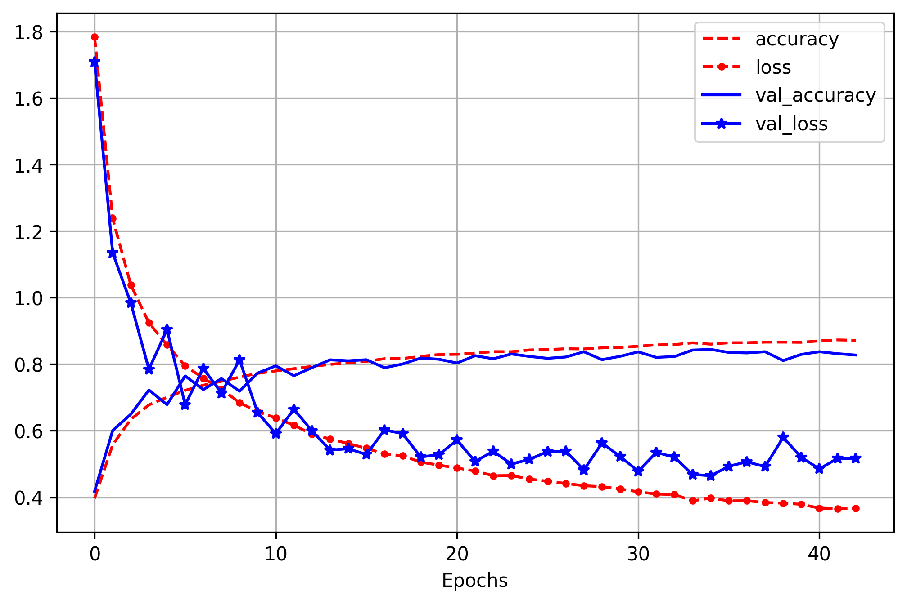
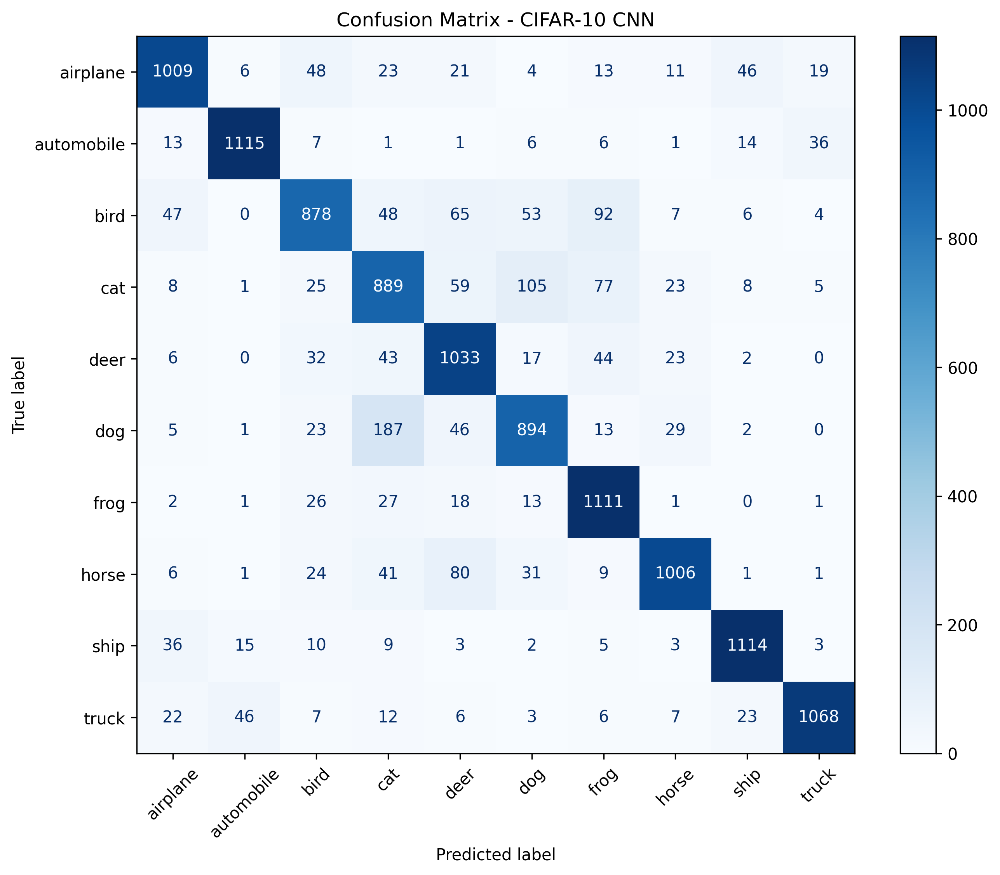

# 🧠 CIFAR-10 Image Classification using Convolutional Neural Networks

## 📌 Project Overview

This project implements a Convolutional Neural Network (CNN) using TensorFlow and Keras to classify images from the CIFAR-10 dataset into 10 different categories. 
The project demonstrates the complete deep learning pipeline, including data preprocessing, model development, training, and evaluation.

---

## 📂 Dataset

The CIFAR-10 dataset contains 60,000 images (32×32 pixels) belonging to 10 classes:

- Airplane
- Automobile
- Bird
- Cat
- Deer
- Dog
- Frog
- Horse
- Ship
- Truck

For this project, the original training and test datasets were combined and then split into new training, validation, and test sets using `train_test_split()`.

---

## 🛠 Technologies

- Python
- TensorFlow
- Keras
- NumPy
- Scikit-learn
- Matplotlib

---

## 🧠 CNN Architecture

The CNN architecture includes:

- Convolutional Layers (Conv2D)
- Max Pooling Layers
- Dropout
- Fully Connected (Dense) Layers
- Softmax Output Layer

---

## ⚙️ Training

The model was trained using:

- Adam Optimizer
- Categorical Crossentropy Loss
- Early Stopping
- Batch Size = 64

---

## 📊 Evaluation

The model performance was evaluated using:

- Accuracy
- Confusion Matrix

Final Test Accuracy: **84.30%**

### Training Performance

---

### Confusion Matrix

---

## 👤 Author

**Konstantina Frangou**

